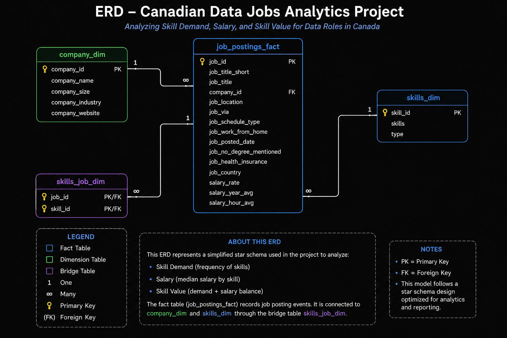

# Exploratory Data Analysis With SQL: Canadian Data Jobs SQL Analysis


## Project Overview

This project explores the Canadian job market for three data roles:

- Data Analyst
- Data Engineer
- Data Scientist

The goal is to use SQL to answer practical questions about:

1. Skill demand
2. Salary
3. Skill value

The analysis focuses on understanding which skills employers request most, which skills are associated with higher salaries, and which skills provide the best balance between demand and pay.

---
# Dataset Structure

The dataset is organized into multiple related tables.

The main tables used in this project are:

- `job_postings_fact` — contains job posting details such as job title, country, and salary
- `skills_job_dim` — connects job postings to skills
- `skills_dim` — contains the skill names

The tables are joined using `job_id` and `skill_id`.
---
## Executive Summary

- **Project Scope** — Explore the Canadian job market for three data roles — **Data Analyst**, **Data Engineer**, and **Data Scientist** — using SQL to answer practical questions about **skill demand**, **salary**, and **skill value**, in order to identify the technologies most relevant to each career path.

- **Data Modeling** — Multi-table **SQL joins** connected fact and dimension tables via `job_id`, `skill_id`, and `company_id`, providing a structured foundation for analysis.

- **Data Analysis** — **Aggregations, CTEs, ranking functions, median salary calculations,** and **window functions** were used to address the objectives outlined above.

- **Outcome** — **SQL and Python are the most in-demand skills across all three roles**, but **specialized skills** such as Snowflake, Pytorch, or Airflow **command higher median salaries**, particularly for **Data Engineers and Data Scientists**. Combining demand and salary, **Data Engineers show the strongest overall skill value**.

if you only a minute, review these:

1. [01_Skill_demand.sql](/1_EDA/01_Skill_demand.sql) - Analysis with multi-table joins and CTEs

2. [02_Salary.sql](/1_EDA/02_Skill_salary.sql) - Analysis with aggregations and window functions

3. [03_Skill_value.sql](/1_EDA/03_Skill_value.sql) - Analysis with ranking functions and median salary calculations

---
## Problem & Context
The project analyzes Canadian job postings to understand **skill demand, salary, and skill value** for three data roles: **Data Analyst**, **Data Engineer**, and **Data Scientist**.

The data follows a star-schema warehouse design.



 A central **fact table**, `job_postings_fact`, links to **dimension tables** for `skills` and `companies`, with `skills_job_dim` serving as a **bridge table** connecting jobs to skills. This structure keeps queries simple and analysis efficient.

 ## Tech Stack
 - DuckDB — Analytical database used to store and efficiently query the job-posting dataset.
- SQL — Core language used for joins, filtering, aggregation, CTEs, window functions, and ranking.
- Star Schema — Data-modeling approach organizing job postings as the fact table with skills and company dimensions.
- VS Code - Integrated Development Environment (IDE) used for data analysis and SQL scripting.
- Git & GitHub — Used for version control, project documentation, and portfolio presentation.

## Analysis Overview

## Querry Structure

1. **[01_Skill_demand.sql](/1_EDA/01_Skill_demand.sql)** - Identify the top 5 skills employers request most for each of the three data roles.

2. **[02_Salary.sql](/1_EDA/02_Skill_salary.sql)** - Analyze the relationship between skills and salary for each of the three data roles.

3. **[03_Skill_value.sql](/1_EDA/03_Skill_value.sql)** - Identify the skills that provide the best balance between demand and salary for each of the three data roles.

## Key Insight
- **SQL and Python are foundational skills** across Data Analyst, Data Engineer, and Data Scientist roles in Canada.
- **High demand does not always mean high salary;** the most frequently requested skills are not necessarily the highest-paying.
- **Specialized skills tend to command higher salaries,** particularly cloud, data engineering, and machine-learning technologies.
- **Data Analysts** benefit most from SQL, Python, and visualization tools such as Tableau and Power BI.
- **Data Engineers** show strong value in cloud and infrastructure skills such as AWS, Snowflake, Airflow, and Redshift.
- **Data Scientists** show high salary potential with machine-learning technologies such as TensorFlow and PyTorch.
- **Best career value comes from balancing demand and salary,** rather than choosing skills based on either metric alone.

## SQL SKILs Demonstrated

### Query Design & Optimization
-**Multi-table joins —** Connected fact, dimension, and bridge tables to combine job, skill, and company data.
- **Aggregations —** Used COUNT() and MEDIAN() to measure skill demand and salary.
- **Filtering —** Applied WHERE and HAVING to focus on relevant roles, countries, valid salaries, and sufficient sample sizes.
- **CTEs —** Broke complex queries into smaller, readable, and maintainable steps.
- **Sorting and limiting —** Used ORDER BY and LIMIT to identify and present the most relevant results.
- **Window functions —** Used ROW_NUMBER() and PARTITION BY to rank skills independently within each data role.
- **Combined ranking —** Combined demand and salary rankings to identify skills offering the strongest overall value.
- **Top-N analysis —** Restricted results to the top five skills per role for easier comparison and visualization.
Data Analysis Techniques

- **Window Functions:** Applied window functions such as ROW_NUMBER() and PARTITION BY to rank skills by demand and salary within each role.

### Data Analysis Techniques
- **Demand analysis:** Measured how frequently skills appear in job postings.
- **Salary analysis:** Used median salary to evaluate earning potential while reducing the impact of outliers.
- **Skill-value analysis:** Balanced demand and salary to identify potentially high-value skills.
- **Comparative analysis:** Compared Data Analyst, Data Engineer, and Data Scientist skill profiles.
- **Normalization:** Used percentages rather than raw counts for fair Canada–U.S. comparisons.
- **Data-quality controls:** Removed missing salary records and used minimum sample thresholds to improve reliability.
- **Insight generation:** Translated SQL results into practical findings about market demand, compensation, and career-relevant skills.

## Research Question 1: Skill Demand

## What are the most in-demand skills for Data Analysts, Data Engineers, and Data Scientists in Canada?

### Objective

The purpose of this analysis is to identify the skills employers request most frequently for each of the three data roles.

Instead of combining all data jobs together, the analysis separates the results by job role. This makes it easier to understand the different skill requirements for Data Analysts, Data Engineers, and Data Scientists.

### SQL Approach

The query:

- Filters job postings to Canada
- Selects the three target data roles
- Joins job postings with their required skills
- Counts how frequently each skill appears
- Ranks the skills within each job role
- Selects the top five skills per role

### Key Findings

| Role | Most In-Demand Skills |
|---|---|
| Data Analyst | SQL, Python, Excel, Tableau, Power BI |
| Data Engineer | SQL, Python, Azure, AWS, Spark |
| Data Scientist | Python, SQL, R, AWS, Azure |

### Insight

SQL and Python appear across all three roles, showing that they are foundational skills in the Canadian data job market.

However, each role also has a different specialization.

- Data Analysts emphasize analytics and visualization tools.
- Data Engineers emphasize cloud and big-data technologies.
- Data Scientists emphasize programming, statistics, and cloud technologies.

---

# Research Question 2: Salary

## Which skills are associated with the highest salaries for Data Analysts, Data Engineers, and Data Scientists in Canada?

### Objective

The purpose of this analysis is to determine whether certain technical skills are associated with higher salaries.

A skill may be highly demanded without necessarily being highly paid. This question therefore examines salary separately from demand.

### SQL Approach

The query:

- Filters jobs to Canada
- Includes only Data Analyst, Data Engineer, and Data Scientist roles
- Removes jobs without annual salary information
- Groups job postings by role and skill
- Calculates the median annual salary for each skill
- Requires at least 10 salary-reported postings
- Ranks the skills by median salary

The following condition is used:

```sql
HAVING COUNT(*) >= 10
```

This helps reduce the influence of skills that appear in only a very small number of salary-reported job postings.

**Why Median Salary?**

Median salary is used instead of average salary because it is less affected by unusually high or low salary values.

**Key Findings**

For Data Analysts, skills such as Spark and Databricks were associated with higher median salaries.

For Data Engineers, PostgreSQL, Redshift, and other infrastructure-related technologies appeared among the higher-paying skills.

For Data Scientists, machine-learning technologies such as TensorFlow and PyTorch were associated with particularly high salaries.

**Insight**

The results suggest that the most frequently requested skills are not always the highest-paying skills.

Common skills may provide broad employment opportunities, while more specialized technologies may be associated with higher compensation.

## Research Question 3: Skill Value

## Which skills offer the best combination of demand and salary?

## Objective

The purpose of this analysis is to identify skills that perform well in both:

- Employer demand
- Median salary

This provides a more practical measure of skill value than looking at demand or salary separately.

## Why This Question Matters

Consider two skills:

- **Skill A** appears in many job postings but is associated with moderate salaries.
- **Skill B** has a high salary but appears in very few postings.

Neither measure alone provides the complete picture. The goal is therefore to identify skills that are both reasonably common and financially valuable.

## SQL Approach

Each skill receives two rankings:

- **Demand Rank**
- **Salary Rank**

These rankings are then combined:

```
Combined Rank = Demand Rank + Salary Rank
```

A lower combined rank represents a stronger balance between demand and salary.

For example:

| Skill | Demand Rank | Salary Rank | Combined Rank |
|---|---|---|---|
| SQL | 1 | 6 | 7 |
| Python | 2 | 8 | 10 |
| Tableau | 3 | 7 | 10 |

The query then selects the top five skills for each job role.

## Key Findings

### Data Analyst

The strongest combination of demand and salary was found among:

1. SQL
2. Python
3. Tableau
4. Excel
5. Power BI

SQL ranked first because of its very high demand while still maintaining a competitive median salary.

### Data Engineer

The strongest combination was found among:

1. Snowflake
2. Java
3. AWS
4. Airflow
5. Redshift

These results highlight the importance of cloud platforms, data warehouses, and data pipeline technologies.

### Data Scientist

The strongest combination was found among:

1. TensorFlow
2. PyTorch
3. Git
4. R
5. Jira

Machine-learning frameworks performed particularly well because they combined relatively strong demand with high median salaries.

## Overall Findings

The three research questions reveal an important pattern.

High demand does not automatically mean high salary. Core skills such as SQL and Python appear frequently across job postings because they are widely used. More specialized technologies may appear less frequently but can be associated with higher salaries.

The strongest career skills therefore tend to be those that combine:

> **Demand + Salary + Role relevance**

The analysis suggests the following general skill profiles:

- **Data Analyst:** SQL + Python + Analytics + Visualization
- **Data Engineer:** Cloud + Data Warehousing + Data Pipelines
- **Data Scientist:** Python + Statistics + Machine Learning

## What I Learned

This project helped strengthen my understanding of:

- SQL joins
- CTEs
- `GROUP BY`
- `COUNT()`
- `MEDIAN()`
- `HAVING`
- Window functions
- `ROW_NUMBER()`
- Ranking data
- Filtering NULL values
- Working with relational datasets
- Converting business questions into SQL queries
- Interpreting analytical results

It also demonstrated an important data-analysis principle:

> A useful analysis should not only describe what is happening in the data, but also explain why the result matters.

## Project Workflow

```
Raw Job Data
      ↓
Filter Canadian Jobs
      ↓
Join Jobs and Skills
      ↓
Aggregate Skill Metrics
      ↓
Rank Skills
      ↓
Analyze Demand
      ↓
Analyze Salary
      ↓
Combine Demand + Salary
      ↓
Generate Insights
```

## Conclusion

This project examined the Canadian job market for Data Analysts, Data Engineers, and Data Scientists from three perspectives.

First, the analysis identified the skills employers request most frequently. Second, it examined which skills are associated with higher salaries. Finally, it combined demand and salary to identify skills that may provide stronger overall career value.

The results show that foundational technologies such as SQL and Python remain important across multiple data careers, while specialized technologies become increasingly important when salary is considered.

For someone entering the data field, this suggests that a strong strategy is to first develop core skills such as SQL and Python, then add specialized technologies based on the desired career path.